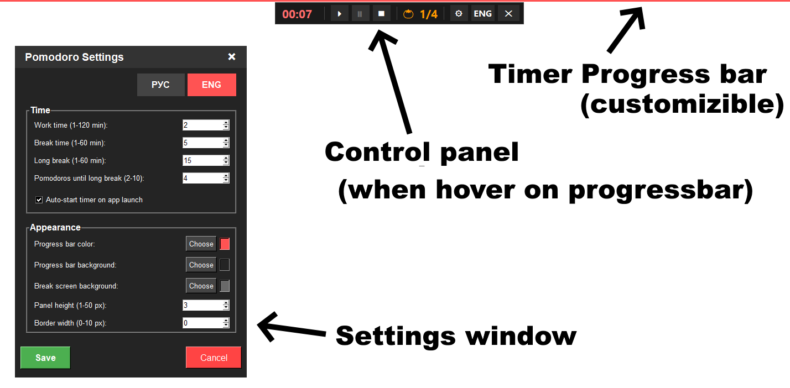
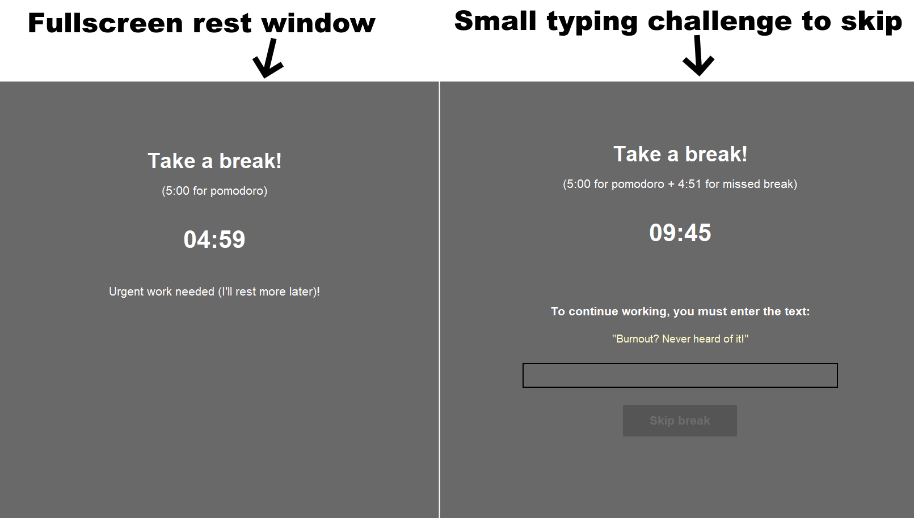

# Yet another pomodoro app?

Normal Pomodoro timers are too easy to ignore. This app makes skipping a break a little more difficult (but not too difficult, since sometimes you really can't take a break instantly).

Work mode: customizible always-on-top draggable timer progress bar, not distracting you from work.

Hidden control panel: hover on timer progress bar to show control panel (with 300ms cooldown).

Settings window: click Settings button on control panel to change timers or appearance of progressbar / rest screen. 

Rest screen: always-on-top fullscreen window that allow you to skip timer with entering skip phrase (skipped time would be added to next rest).

## Usage (windows)
- Download .exe from releases
  
    **or**

- Make sure you have Python 3.7+ installed ([Download Python](https://www.python.org/downloads/))
- Open Pomodoro.pyw

## Usage (linux) - work in progress
- Install tkinter (sudo apt-get install python3-tk)
- Open Pomodoro.pyw (python3 Pomodoro.pyw)
    
## License

This project is licensed under the GNU General Public License v3.0.  

See the [LICENSE](LICENSE) file for the full text.
